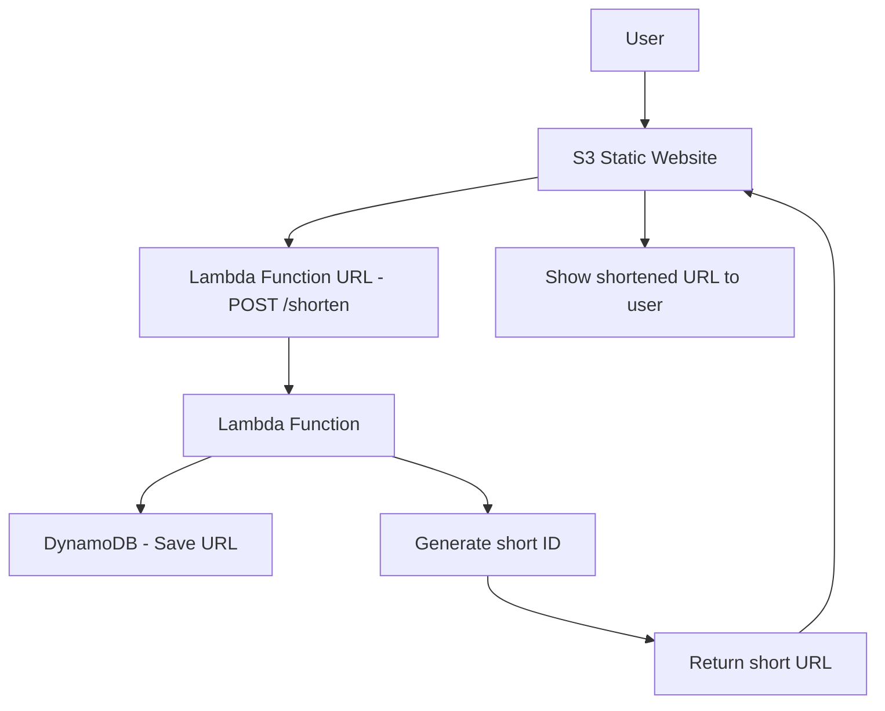

# 🚀 BLINKLINK URL Shortener Project - Setup Tutorial

Step-by-step guide to setting up a BlinkLinlk - URL shortening service using AWS Lambda, Lambda Function URL DynamoDB, and S3 we  .

---

## 📋 Prerequisites

* Active AWS account
* IAM permissions to create/edit AWS services:
  -In this Tutorial we will use `LabRole`
* Python 3.12+ installed locally
* Basic AWS Console knowledge

---

## 🏗️ Architecture Overview




---

## 📚 Step 1: Create DynamoDB Table

### 1.1 Open DynamoDB Console

1. Log into AWS Console
2. Search for "DynamoDB"
3. Click on "DynamoDB"

### 1.2 Create Table

1. Click **"Create table"**
2. Enter:

   * **Table name**: `ShortUrls`
   * **Partition key**: `id` (String)
3. Leave defaults as is
4. Click **"Create table"**

### 1.3 Wait for Table to Be Active

* Wait until status is "Active" (\~1-2 minutes)

---

## ⚡ Step 2: Create Lambda Function

### 2.1 Open Lambda Console

1. Search for "Lambda"
2. Click on "Lambda"

### 2.2 Create a New Function

1. Click **"Create function"**
2. Choose **"Author from scratch"**
3. Enter:

   * **Function name**: `url-shortener`
   * **Runtime**: `Python 3.11`
   * **Architecture**: `x86_64`

### 2.3 Set Permissions

1. Under **"Change default execution role"**, select **"Create a new role with basic Lambda permissions"**
2. Click **"Create function"**

### 2.4 Add DynamoDB Permissions

1. Open the function page
2. Go to **"Configuration"** → **"Permissions"**
3. Click on the role name (e.g. `url-shortener-role-xxxxx`)
4. In IAM, click **"Add permissions"** → **"Attach policies"**
5. Search for `AmazonDynamoDBFullAccess`
6. Check it and click **"Add permissions"**

---

## 📦 Step 3: Upload Code

### 3.1 Prepare Folder Structure

Create a new folder `url-shortener-lambda` and use this structure:

```
url-shortener-lambda/
├── lambda_function.py
├── handlers/
│   ├── __init__.py
│   ├── redirect_handler.py
│   └── create_handler.py
├── services/
│   ├── __init__.py
│   ├── database_service.py
│   └── id_generator.py
└── utils/
    ├── __init__.py
    ├── response_builder.py
    └── request_parser.py
```

### 3.2 Copy Your Code

Place all Python files in the correct folders.

### 3.3 Create a ZIP File

* **Windows**: Select files/folders → Right-click → "Send to" → "Compressed folder"
* **Mac**: Right-click → "Compress items"
* **Linux**: `zip -r url-shortener.zip *`

> ⚠️ Make sure files are at the root of the ZIP, not inside a subfolder!

### 3.4 Upload to Lambda

1. Go to your Lambda function
2. In **"Code"** tab, click **"Upload from"** → **".zip file"**
3. Select your ZIP file
4. Click **"Save"**

---

## 🌐 Step 4: Configure Lambda Function URL

### 4.1 Enable Function URL

1. In your Lambda function page, click **"Configuration"** → **"Function URL"**
2. Click **"Create function URL"**
3. Choose:

   * **Auth type**: `NONE` (for public access)
4. Click **"Save"**

### 4.2 Get Your Function URL

You’ll receive a URL like:

```
https://xxxxxx.lambda-url.region.on.aws/
```

This URL will be used for both POST and GET requests.

> ⚠️ You may need to add logic in your code to distinguish between `POST /shorten` and `GET /{id}` requests.

---

## 🧪 Step 5: Test It!

### 5.1 Create a Link

```bash
curl -X POST https://your-function-url/ \
  -H "Content-Type: application/json" \
  -d '{"url": "https://www.google.com"}'
```

Expected response:

```json
{"short_id": "abc123"}
```

### 5.2 Test Redirection

```bash
curl -L https://your-function-url/abc123
```

### 5.3 Browser Test

Open in browser: `https://your-function-url/abc123`

---

## 📊 Step 6: Logs & Monitoring

### 6.1 View Logs in CloudWatch

1. Open Lambda function
2. Go to **"Monitor"** tab → **"View logs in CloudWatch"**

### 6.2 View Table Items

1. Go to DynamoDB Console → `ShortUrls` table
2. Click **"Explore table items"**

---

## 🔧 Step 7: Advanced Settings (Optional)

### 7.1 Custom Domain Name (via CloudFront + Route 53)

1. Set up a custom domain using Amazon CloudFront
2. Attach your Lambda Function URL as the origin
3. Configure Route 53 to point your domain to the CloudFront distribution

### 7.2 Add Expiry Logic or Analytics

1. Modify your Lambda code to handle link expiration
2. Track click counts and log to CloudWatch or another service

---

## 💰 Expected Costs (us-east-1)

* **Lambda**: \~\$0.20 per million requests + runtime
* **DynamoDB**: \~\$0.25 per million reads/writes
* **Function URL**: Free (part of Lambda)

**Example for 10,000 monthly uses:**

* Lambda: \~\$0.01
* DynamoDB: \~\$0.01
* **Total: \~\$0.02/month**

---

## 🤜 Common Errors & Fixes

### "Unable to import module 'lambda\_function'"

* Ensure all files are at ZIP root level

### "User is not authorized to perform: dynamodb\:PutItem"

* Make sure the `AmazonDynamoDBFullAccess` policy is attached

### Redirect not working

* Confirm your Lambda logic is properly routing based on `event['rawPath']` or `event['path']`

### CORS Error

* Add CORS headers manually in your Lambda response

---

## 🚀 Upgrade Ideas

1. Analytics for clicks
2. Custom domains per user
3. User authentication
4. Expiration dates for links
5. QR code generation

---

## 📞 Need Help?

1. Check logs in CloudWatch
2. Ensure all services are in the same region
3. Double-check IAM permissions

---

## ✅ Summary

After following all steps, your URL shortener is ready:

* ✅ Create short links
* ✅ Automatic redirection
* ✅ Safe storage in DynamoDB
* ✅ Full Lambda logic with error handling
* ✅ Logging and monitoring
* ✅ Super low cost

**That's it! You're ready to go live! 🎉**
