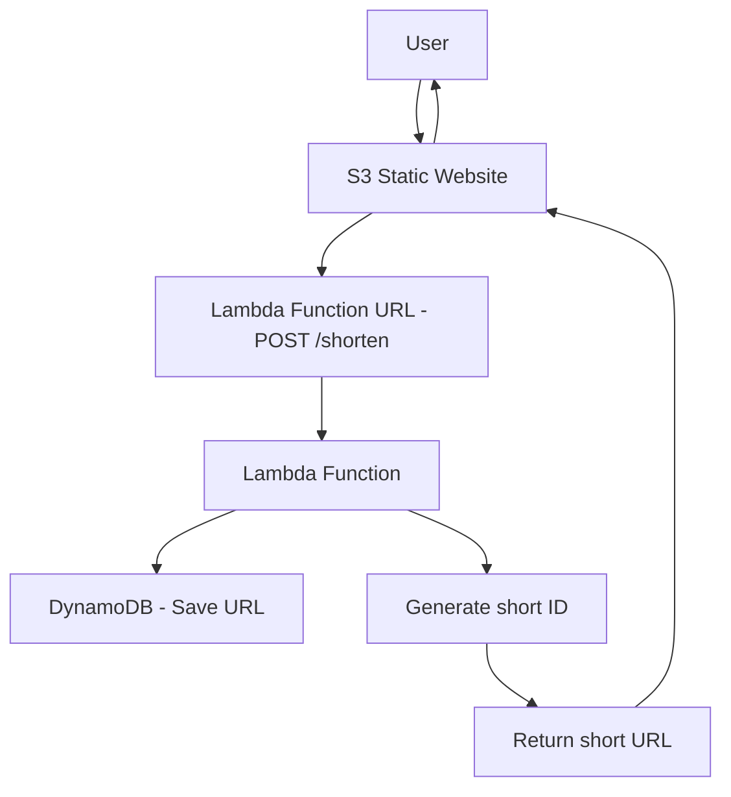

# 🚀 BLINKLINK URL Shortener Project - Setup Tutorial

Step-by-step guide to setting up a BlinkLinlk - URL shortening service using AWS Lambda, Lambda Function URL DynamoDB, and S3 we  .

---

## 📋 Prerequisites

* Active AWS account
* IAM permissions to create/edit AWS services:
  -In this Tutorial we will use `LabRole`
* Python 3.12+ installed locally
* Basic AWS Console knowledge

---

## 🏗️ Architecture Overview




---

## 📚 Step 1: Create DynamoDB Table

### 1.1 Open DynamoDB Console

1. Log into AWS Console
2. Search for "DynamoDB"
3. Click on "DynamoDB"


### 1.2 Create Table

1. Click **"Create table"**
   

3. Enter:

   * **Table name**: `ShortUrls`
   * **Partition key**: `id` (String)
     

4. Leave defaults as is
5. Click **"Create table"**


### 1.3 Wait for Table to Be Active

* Wait until status is "Active" (\~1-2 minutes)

---

## ⚡ Step 2: Create Lambda Function

### 2.1 Open Lambda Console

1. Search for "Lambda"
2. Click on "Lambda"


### 2.2 Create a New Function

1. Click **"Create function"**
   

3. Choose **"Author from scratch"**
4. Enter:
   * **Function name**: `url-shortener`
   * **Runtime**: `Python 3.12`
   * **Architecture**: `arm64`


### 2.3 Set Permissions

1. Under **"Change default execution role"**, select **"Use an existing role"**. From the dropdown option choose `LabRole`
2. Click **"Create function"**


---

## 📦 Step 3: Upload Code

### 3.1 Prepare Folder Structure

Create a new folder `url-shortener-lambda` and use this structure:

```
url-shortener-lambda/
├── lambda_function.py
├── handlers/
│   ├── __init__.py
│   ├── redirect_handler.py
│   └── create_handler.py
├── services/
│   ├── __init__.py
│   ├── database_service.py
│   └── id_generator.py
└── utils/
    ├── __init__.py
    ├── response_builder.py
    └── request_parser.py
```

### 3.2 Copy Your Code

Place all Python files in the correct folders.

### 3.3 Create a ZIP File

* **Windows**: Select files/folders → Right-click → "Send to" → "Compressed folder"
* **Mac**: Right-click → "Compress items"
* **Linux**: `zip -r url-shortener.zip *`

> ⚠️ Make sure files are at the root of the ZIP, not inside a subfolder!

### 3.4 Upload to Lambda

1. Go to your Lambda function
2. In **"Code"** tab, click **"Upload from"** → **".zip file"**

   

4. Select your ZIP file
5. Click **"Save"**
   


---

## 🌐 Step 4: Configure Lambda Function URL

### 4.1 Enable Function URL

1. In your Lambda function page, click **"Configuration"** → **"Function URL"**
2. Click **"Create function URL"**


3. Choose:

   * **Auth type**: `NONE` (for public access)
4. Click **"Save"**


### 4.2 Get Your Function URL

You’ll receive a URL like:

```
https://xxxxxx.lambda-url.region.on.aws/
```

This URL will be used for both POST and GET requests.


---

## 📂 Step 5: Create and Configure S3 Static Website

### 5.1 Create an S3 Bucket

1. Go to the AWS Console and search for "S3"


2. Click "Create bucket"


3. Choose bucket type `General purpose`
4. Enter a unique Bucket name, e.g., `blinklink-frontend`
5. Under Object Ownership - choose `ACLs disabled (recommended)`

6.  Uncheck "Block all public access" (you will be prompted to acknowledge this change)
7.  Click "Create bucket"


### 5.2 Upload Website Files

1. Prepare your HTML/JS/CSS files locally
2. Click on your bucket name


3. Click "Upload" → Drag and drop or choose your files or folder → Click "Upload"


### 5.3 Enable Static Website Hosting

1. Inside your bucket, go to the "Properties" tab


2. Scroll to "Static website hosting" and click "Edit"


3. Select "Enable"
4. Under Index document: index.html (this is the html file that you updated earlier)
5. (Optional) Error document: error.html
6. Click "Save changes"


Scroll to the bottom of the page - you will see a static website endpoint URL. This is your frontend's public URL.
Copy it, we will use it later:


### 5.4 Set Permissions for Public Access

1. Go to the "Permissions" tab of your bucket
2. Scroll to "Bucket policy" and click "Edit"


3. Paste the following policy (replace your-bucket-name), if you don't remember your bucket name, you can find it written under **"Bucket ARN**:
`
{
  "Version": "2012-10-17",
  "Statement": [
    {
      "Sid": "PublicReadGetObject",
      "Effect": "Allow",
      "Principal": "*",
      "Action": "s3:GetObject",
      "Resource": "arn:aws:s3:::your-bucket-name/*"
    }
  ]
}
`
4. Click **Save Changes**

   

---

## 🤜 Common Errors & Fixes

### "Unable to import module 'lambda\_function'"

* Ensure all files are at ZIP root level

### "User is not authorized to perform: dynamodb\:PutItem"

* Make sure the `AmazonDynamoDBFullAccess` policy is attached

### Redirect not working

* Confirm your Lambda logic is properly routing based on `event['rawPath']` or `event['path']`

### CORS Error

* Add CORS headers manually in your Lambda response

---

## 🚀 Upgrade Ideas

1. Analytics for clicks
2. Custom domains per user
3. User authentication
4. Expiration dates for links
5. QR code generation

---

## 📞 Need Help?

1. Check logs in CloudWatch
2. Ensure all services are in the same region
3. Double-check IAM permissions

---

## ✅ Summary

After following all steps, your URL shortener is ready:

* ✅ Create short links
* ✅ Automatic redirection
* ✅ Safe storage in DynamoDB
* ✅ Full Lambda logic with error handling
* ✅ Logging and monitoring
* ✅ Super low cost

**That's it! You're ready to go live! 🎉**
